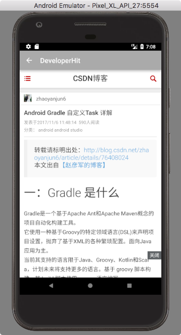

#DeveloperHit

After exploring some Web APIs associated with the chosen topic, only a few websites provide friendly APIs, especially when an XML format data response is expected. Therefore we decided to build our own APIs by parsing HTML pages responded from target websites：

- Github

  Github trending exhibits some potential open source projects, however, there are only APIs for specific repository and user. So we will build an unofficial XML-based backend.

- V2EX

  V2EX is a community about technology and design. It provides some APIs for getting latest posts.

- Gank

  Gank.io is a website which provides some interesting frameworks and projects for programmers. Thus, it also pushes some news in software engineering.

- Zhihu

  Zhihu may be the biggest Q&A community in China. We will write a backend with RESTful API, which providing some development-related topic content.

The frontend will integrate lastest and hot information in a list for users. And we plan to implement it on  Web, iOS and Android platform.

##Backend

| Content | URL                                      |
| ------- | ---------------------------------------- |
| GitHub  | http://115.159.1.222:8000/github         |
| Zhihu   | http://115.159.1.222:3001/topic          |
| V2EX    | https://www.v2ex.com/api/topics/hot.json |
| Gank    | http://gank.io/api/day/2015/08/07        |

##Android

###Dependencies

```java
compile 'io.reactivex:rxandroid:1.1.0'
compile 'io.reactivex:rxjava:1.1.3'
compile 'com.squareup.retrofit:retrofit:2.0.0-beta1'
compile 'com.squareup.retrofit2:retrofit:2.0.0-beta4'
compile 'com.squareup.retrofit:converter-gson:2.0.0-beta2'
compile 'com.android.support:support-v4:23.4.0'
compile 'com.squareup.retrofit:adapter-rxjava:2.0.0-beta2'
compile 'com.astuetz:pagerslidingtabstrip:1.0.1'
compile 'com.facebook.fresco:fresco:0.9.0+'
compile ('com.squareup.retrofit2:converter-simplexml:2.1.0'){
    exclude group: 'xpp3', module: 'xpp3'
    exclude group: 'stax', module: 'stax-api'
    exclude group: 'stax', module: 'stax'
}
compile 'io.reactivex.rxjava2:rxjava:2.1.6'
compile 'com.squareup.retrofit2:adapter-rxjava2:2.3.0'
compile 'io.reactivex.rxjava2:rxandroid:2.0.1'
```

###How to run

- Just download the project and run in android studio

###Screenshot

- GitHub


- V2EX


- Gank



- ZhiHu


