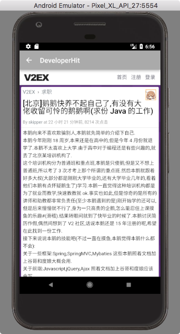
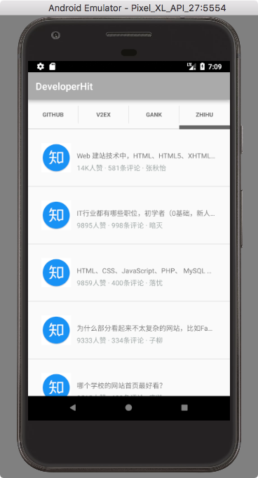

# DeveloperHit

After exploring some Web APIs associated with the chosen topic, only a few websites provide friendly APIs, especially when an XML format data response is expected. Therefore we decided to build our own APIs by parsing HTML pages responded from target websites:

- Github

  Github trending exhibits some potential open source projects, however, there are only APIs for specific repository and user. So we will build an unofficial XML-based backend.

- V2EX

  V2EX is a community about technology and design. It provides some APIs for getting latest posts.

- Gank

  Gank.io is a website which provides some interesting frameworks and projects for programmers. Thus, it also pushes some news in software engineering.

- Zhihu

  Zhihu may be the biggest Q&A community in China. We will write a backend with RESTful API, which providing some development-related topic content.

The frontend will integrate lastest and hot information in a list for users. And we plan to implement it on  Web, iOS and Android platform.

## Backend

| Content | URL                                      |
| ------- | ---------------------------------------- |
| GitHub  | http://115.159.1.222:8000/github         |
| Zhihu   | http://115.159.1.222:3001/topic          |
| V2EX    | https://www.v2ex.com/api/topics/hot.json |
| Gank    | http://gank.io/api/day/2015/08/07        |

## Android

Android client is based on listview to show information from four different website. I use retrofit to make http&https requests, use converter-gson and converter-simplexml to parse data, and use rxjava to deal with asynchronous.

### Data parsing

- deal with json example

  - service

    ```java
    public interface GankService {
        @GET("/api/data/all/20/1")
        Observable<GankModel> getData();
    }
    ```

  - model

    ```java
    public class GankModel {
        @SerializedName("results")
        private ArrayList<Result> resultArrayList;
        public ArrayList<Result> getResultArrayList() {
            return resultArrayList;
        }
        public void setResultArrayList(ArrayList<Result> resultArrayList) {
            this.resultArrayList = resultArrayList;
        }
        public static class Result{
            @SerializedName("type")
            private String type;
            @SerializedName("desc")
            private String title;
            @SerializedName("url")
            private String url;
            @SerializedName("publishedAt")
            private String publishedAt;
            @SerializedName("who")
            private String who;
            public String getTitle() {
                if(title == null&&title==""){
                    return "None";
                }
                return title;
            }
            public void setTitle(String title) {
                this.title = title;
            }
            public String getUrl() {
                if(url==null&&url==""){
                    return "http://gank.io";
                }
                return url;
            }
            public void setUrl(String url) {
                this.url = url;
            }
            public String getType() {
                if (type==null&&type==""){
                    return "None";
                }
                return type;
            }
            public void setType(String type) {
                this.type = type;
            }
            public String getWho() {
                if(who==null&&who==""){
                    return "None";
                }
                return who;
            }
            public void setWho(String who) {
                this.who = who;
            }
            public String getPublishedAt() {
                if(publishedAt==null&&publishedAt==""){
                    return "None";
                }
                return publishedAt;
            }
            public void setPublishedAt(String publishedAt) {
                this.publishedAt = publishedAt;
            }
        }
    }
    ```

    ​

- deal with xml example

  - service

    ```java
    public interface GitHubService {
        @GET("/github")
        Observable<GitHubModel> getData();
    }
    ```

  - model

    ```java
    package com.xiaojin.developerkit.Model;
    import com.google.gson.annotations.SerializedName;
    import org.simpleframework.xml.Element;
    import org.simpleframework.xml.ElementList;
    import org.simpleframework.xml.Root;
    import java.util.ArrayList;

    @Root(name = "projects",strict = false)
    public class GitHubModel {
        @ElementList(inline = true,entry = "project",required = false)
        private ArrayList<Project> projects;

        public ArrayList<Project> getProjects() {
            return projects;
        }
        public void setProjects(ArrayList<Project> projects) {
            this.projects = projects;
        }
        @Root(name = "project",strict = false)
        public static class Project{
            @Element(name = "owner",required = false)
            private String owner;
            @Element(name = "repository_name",required = false)
            private String repository_name;
            @Element(name = "name",required = false)
            private String name;
            @Element(name = "descriptions",required = false)
            private String descriptions;
            @Element(name = "language",required = false)
            private String language;
            @Element(name = "stars",required = false)
            private String stars;
            @Element(name = "url",required = false)
            private String url;
            @ElementList(entry = "contributor",inline = true,required = false)
            private ArrayList<Contributor> contributors;
            public String getDescriptions() {
                if (descriptions == null)
                    return "This article does not have a title, please click to view details";
                return descriptions;
            }
            public void setDescriptions(String descriptions) {
                this.descriptions = descriptions;
            }
            public String getTitle(){
                if (descriptions == null)
                    return "This article does not have a title, please click to view details";
                return descriptions;
            }
            public String getUrl() {
                if (url == null){
                    return "https://github.com/";
                }
                return url;
            }
            public void setUrl(String url) {
                this.url = url;
            }
            public ArrayList<Contributor> getContributors() {
                return contributors;
            }
            public void setContributors(ArrayList<Contributor> contributors) {
                this.contributors = contributors;
            }
            public String getName() {
                if(name == null){
                    return "None";
                }

                return name;
            }
            public void setName(String name) {
                this.name = name;
            }
            public String getLanguage() {
                if(language == null){
                    return "None";
                }
                return language;
            }
            public void setLanguage(String language) {
                this.language = language;
            }
            public String getStars() {
                return stars;
            }
            public void setStars(String stars) {
                this.stars = stars;
            }
            public String getOwner() {
                return owner;
            }
            public void setOwner(String owner) {
                this.owner = owner;
            }
            public String getRepository_name() {
                return repository_name;
            }
            public void setRepository_name(String repository_name) {
                this.repository_name = repository_name;
            }
            @Root(name = "contributor", strict = false)
            public static class Contributor{

                @Element(name = "avatar",required = false)
                private String avatar;


                public String getAvatar() {
                    return avatar;
                }

                public void setAvatar(String avatar) {
                    this.avatar = avatar;
                }

            }
        }
        public static class Repository {
            @SerializedName("subscribers_count")
            private String watchers_count;
            @SerializedName("forks_count")
            private String forks_count;

            public String getWatchers_count() {
                return watchers_count;
            }
            public void setWatchers_count(String watchers_count) {
                this.watchers_count = watchers_count;
            }
            public String getForks_count() {
                return forks_count;
            }
            public void setForks_count(String forks_count) {
                this.forks_count = forks_count;
            }
        }

    }
    ```

### Dependencies

```
compile 'io.reactivex:rxandroid:1.1.0'
compile 'io.reactivex:rxjava:1.1.3'
compile 'com.squareup.retrofit:retrofit:2.0.0-beta1'
compile 'com.squareup.retrofit2:retrofit:2.0.0-beta4'
compile 'com.squareup.retrofit:converter-gson:2.0.0-beta2'
compile 'com.android.support:support-v4:23.4.0'
compile 'com.squareup.retrofit:adapter-rxjava:2.0.0-beta2'
compile 'com.astuetz:pagerslidingtabstrip:1.0.1'
compile 'com.facebook.fresco:fresco:0.9.0+'
compile ('com.squareup.retrofit2:converter-simplexml:2.1.0'){
    exclude group: 'xpp3', module: 'xpp3'
    exclude group: 'stax', module: 'stax-api'
    exclude group: 'stax', module: 'stax'
}
compile 'io.reactivex.rxjava2:rxjava:2.1.6'
compile 'com.squareup.retrofit2:adapter-rxjava2:2.3.0'
compile 'io.reactivex.rxjava2:rxandroid:2.0.1'
```

### How to run

- Just download the project and run in android studio

### Screenshot

- GitHub


- V2EX



- Gank


- ZhiHu



### Web

- Repo:  https://github.com/lisirrx/DevelopmentHit

### IOS

- Repo：https://github.com/zjzsliyang/DeveloperHit